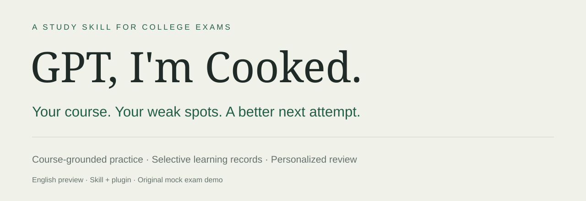
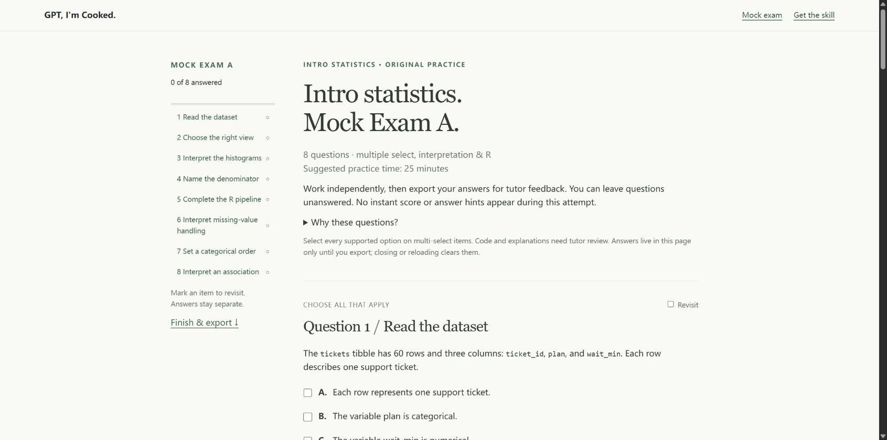
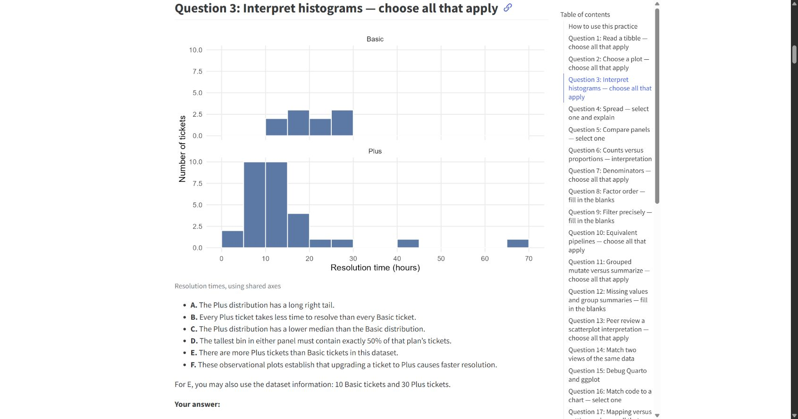
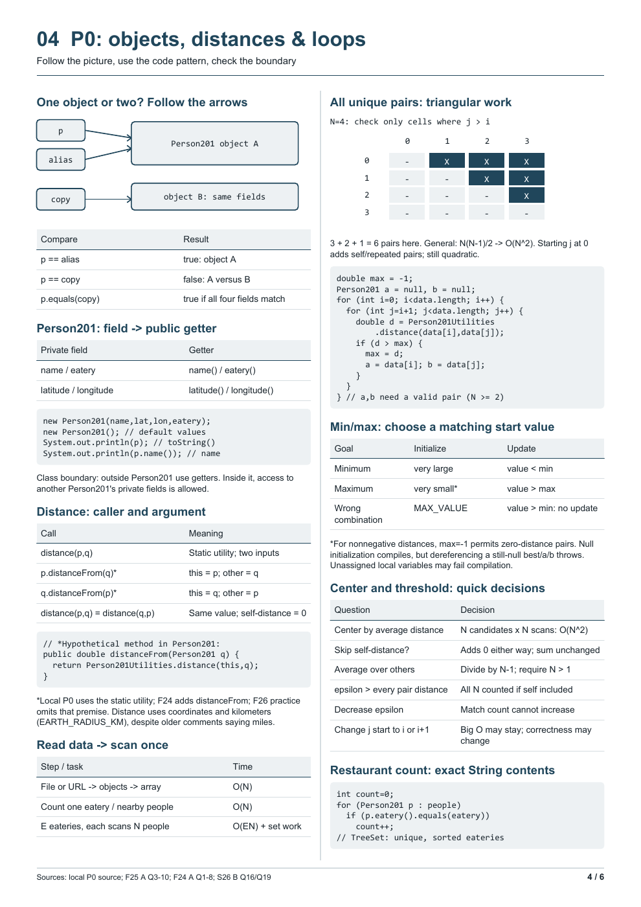

<p align="center"></p>

<p align="center"><a href="https://jernb.github.io/gpt-im-cooked/demo.html"><strong>Try the mock exam</strong></a> · <a href="#quick-start">Get started</a> · <a href="docs/INSTALLATION.md">Install</a> · <a href="VALIDATION.md">Testing & limitations</a></p>

A reusable **English exam-review skill and plugin** for college students. Bring your course materials and attempts; build original practice, review your reasoning, and use a saved learning record to decide what to study next.

**Preview v0.3.1** · Main skill: `$gpt-im-cooked` · Codex-ready instructions · No bundled AI server

## Try an exam-style demo

[](https://jernb.github.io/gpt-im-cooked/demo.html)

**[Open the interactive mock exam →](https://jernb.github.io/gpt-im-cooked/demo.html)** · **[Visit the project page →](https://jernb.github.io/gpt-im-cooked/)**

An original, eight-question statistics paper with multiple-select questions, graph interpretation, and R code completion. Navigate the paper, mark items to revisit, record reasoning and confidence, then export your attempt. The answer key stays in a separate page.

The layout is inspired by a college mock-exam study workflow. The public demo uses a **fictional course packet and student record**; it does not reproduce an instructor's paper or use private study notes. It has no AI connection or automatic grading. Attach its exported JSON to your tutor for feedback and reviewed record updates.

[Course packet](docs/course-packet.md) · [Synthetic learning record](docs/learning-record.md) · [Question blueprint](docs/content-map.md) · [Separate solutions](docs/answer-key.html)

## Real study examples

**[Explore the real STA199 and CS201 cases →](https://jernb.github.io/gpt-im-cooked/examples/)**

These are the creator's actual study artifacts from the workflow that inspired the skill, shared for others to explore. The sessions predate the packaged release; they demonstrate the workflow, not measured learning gains from installing the plugin.

### STA199: a mock midterm shaped by saved learning evidence

[](https://jernb.github.io/gpt-im-cooked/examples/sta199/)

**[Open the original 32-question Mock Practice B](https://jernb.github.io/gpt-im-cooked/examples/sta199/practice/STA199_Mock_Practice_B.html)** · **[Download the editable QMD + datasets + six graphs](docs/examples/sta199/practice-pack.zip)**

The real record remembers a grouped-`mutate` row-count error, a duplicate-key join error, and multiple-select difficulties. It also removes stale weakness labels after correct execution, and distinguishes self-reported difficulty from assisted-session improvement. Those priorities inform new practice while retaining broad course coverage.

[Case walkthrough & reusable English prompts](https://jernb.github.io/gpt-im-cooked/examples/sta199/) · [English selection of the learning evidence](docs/examples/sta199/learning-record-english.md) · [Original Chinese study record](docs/examples/sta199/learning-record-original.md) · [Separate answer key (spoilers)](docs/examples/sta199/answer-key.md)

The original Quarto HTML is a browser-readable worksheet. Edit the QMD to answer and run R code; it has no automatic grading. The public record removes only computer-local absolute paths and adds a publication note. Private student attempts referenced in that record are not bundled.

### CS201: the actual six-page personalized review guide

[](https://jernb.github.io/gpt-im-cooked/examples/cs201/)

**[Read or download the original PDF](docs/examples/cs201/guide.pdf)** · **[Browse all six pages and the case walkthrough](https://jernb.github.io/gpt-im-cooked/examples/cs201/)** · [English source draft](docs/examples/cs201/guide-source.md)

The student's missed questions and follow-up requests became exact constructor traces, identity/equality tables, P0 reference diagrams, P1 token-window visuals, runtime reminders, and relevant APT patterns. This shows a personalized guide built from supplied course code and specific difficulties. The PDF is unchanged; reference-sheet permission depends on your own course.

## What makes it useful

| Principle | What happens in your review |
|---|---|
| **Your supplied course is the boundary** | Teaching rules need a source in your accessible notes. Missing content is flagged; excluded topics stay out. |
| **Remember useful learning evidence** | Save meaningful mistakes, specific difficulties, assisted attempts, and improvements. Read that record when resuming. |
| **Personalize the next output** | Emphasize your documented weak spots in an instructor-style mock exam, focused practice, review guide, or permitted reference sheet. |

Past papers provide evidence of question formats and reasoning patterns. New questions use original situations. A mock exam keeps breadth; a focused drill can concentrate on one weakness. The skill does not predict the next exam or promise a grade.

## Quick start

1. **[Download the standalone skill](https://jernb.github.io/gpt-im-cooked/downloads/gpt-im-cooked-skill-v0.3.1.zip)** and extract the `gpt-im-cooked` folder.
2. Copy that entire folder into `~/.codex/skills/` (or your configured `$CODEX_HOME/skills/`). Preserve an existing copy unless you intend to replace it. Refresh the skill list or restart the client if needed, then open a new chat.
3. Add one useful course file and send:

```text
Use $gpt-im-cooked to help me prepare for my midterm.
Here are my notes, exam outline, and any practice papers I have.
Include the covered topics; exclude anything outside these materials.
Keep solutions separate until I ask. After I submit an attempt,
explain my mistakes and save relevant difficulties and improvements.
Then make an original mock exam webpage in my instructor's formats,
or a personalized review guide.
```

You can start with a single outline or set of notes. Past exams, dates, and official keys help, but are optional. The first-use guide explains the loop and proceeds with the material already supplied.

**Prefer the plugin?** [Download the plugin package](https://jernb.github.io/gpt-im-cooked/downloads/gpt-im-cooked-plugin-v0.3.1.zip) and follow the [plugin installation guide](docs/INSTALLATION.md). It bundles the same review skill plus onboarding. Local marketplace support varies by client; install one route for normal use to avoid duplicate entries.

**Try without installing:** clone or download the repository, keep the whole skill folder accessible, and ask Codex to read [SKILL.md](plugins/exam-loop/skills/gpt-im-cooked/SKILL.md) and its relevant supporting files. This manual preview does not test automatic plugin discovery.

## The study loop

**Course scope → independent attempt → feedback → learning record → targeted practice → review output**

| You want to… | Say… |
|---|---|
| Check the boundary | “Compare my notes with the exam outline. Flag missing content.” |
| Get a nudge | “Give me a small hint for question 4, without the answer.” |
| Review an attempt | “Check my answers and reasoning. Keep my original attempt.” |
| Practice like the exam | “Use these papers' formats to build an original mock exam webpage with a separate key.” |
| Target a difficulty | “Give me new questions on my recent denominator mistakes.” |
| Make a guide | “Make an English review guide from my weak concepts.” |
| Resume | “Continue from my course profile and saved learning record.” |

In a writable workspace, the tutor saves a course profile and selective learning record, usually under `study/<course>/<exam>/`. Student data stays outside the installed package. A new chat must have access to that record; bring it when switching computers. Browser exports require tutor review before the record changes.

Every tutoring reply starts with **“Hi student, let's get you uncooked.”** It is a visible workflow marker. It cannot measure remaining context. If it disappears, ask the tutor to reread the skill and accessible saved records.

## What has been tested

The previous v0.3.0 run used five isolated tutoring contexts and 14 total turns, including fresh-chat resume, selective record updates, scope boundaries, and browser export import. The earlier coached page was tested in Chrome. Those archived results describe the tested snapshots, not every later revision.

The v0.3.1 update adds the exam-style demo and clearer presentation. See [validation status](VALIDATION.md), the [new demo check](tests/reports/2026-10-10/SHOWCASE.md), and the [earlier model run](tests/reports/2026-10-10/REPORT.md). Actual plugin installation/discovery and real-student learning gains remain unverified.

## Explore the package

- [Review skill](plugins/exam-loop/skills/gpt-im-cooked/SKILL.md) and [onboarding skill](plugins/exam-loop/skills/examloop-start/SKILL.md)
- [Installation and updates](docs/INSTALLATION.md)
- [Evaluation method](tests/EVALUATION.md) and [22 behavioral pilot cases](tests/PILOT-CASES.md)
- [Earlier worked demonstration](examples/DEMO.md) and [fresh-chat review guide](tests/reports/2026-10-10/resume/outputs/review-guide-01.md)

For development checks, install PyYAML and run `python tests/validate_package.py`. This checks package structure; it does not install the plugin or evaluate learning gains.

The project was previously named **ExamLoop**. The repository's new name is **gpt-im-cooked**; the internal plugin ID remains `exam-loop` for continuity. This is a skills-only preview, not a public plugin-directory listing. Code execution, browsing, and PDF generation depend on the host's available tools.
