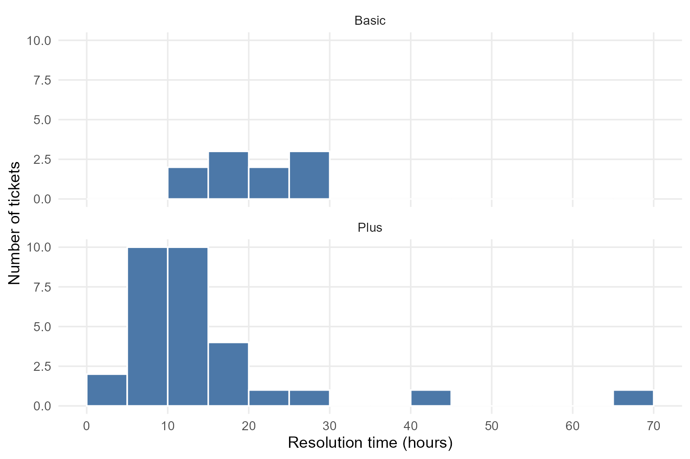
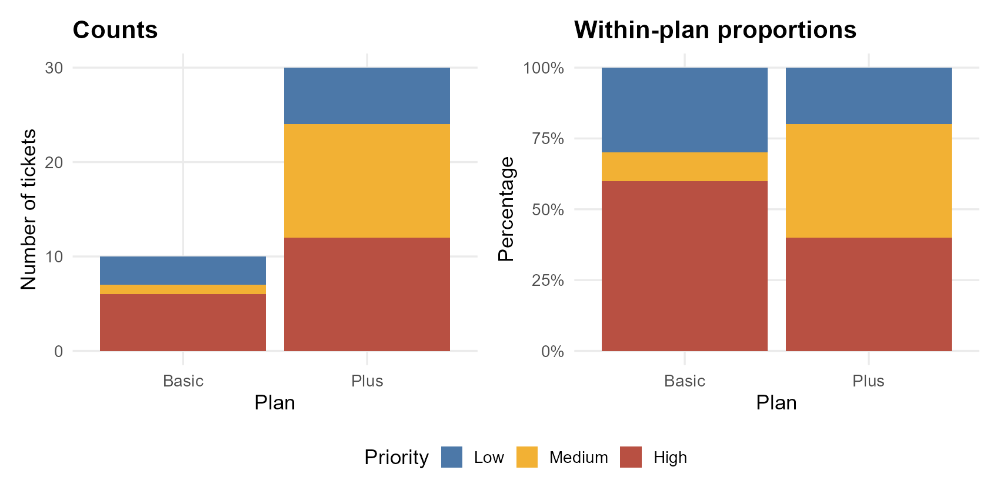
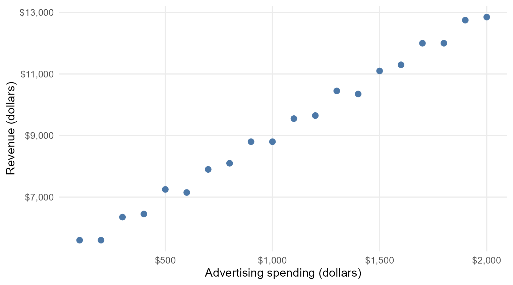
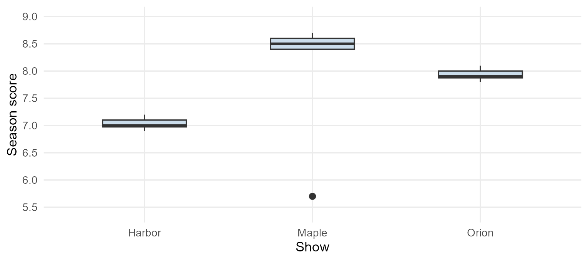
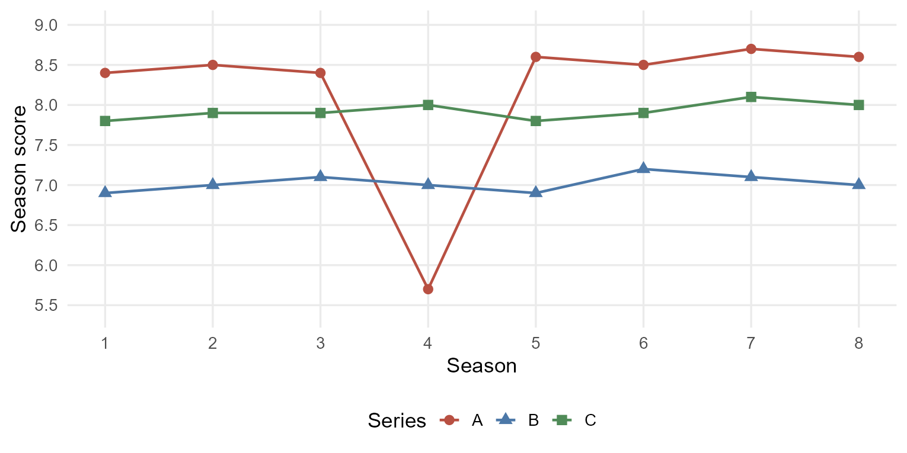
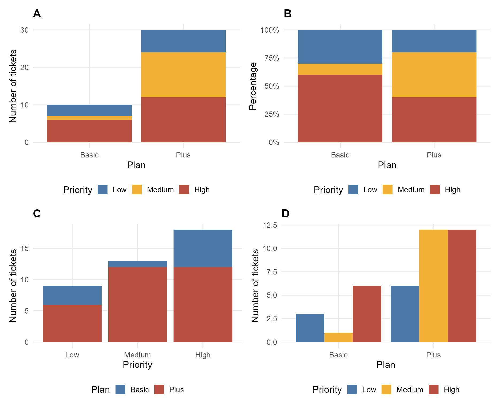

## How to use this practice

**First pass: 80–90 minutes, with your double-sided notes.** Read code without running it. This is a practice target, not a statement of your actual exam's time limit.

- All questions and datasets are original and fictional. They practice the formats in the 2025 and 2026 exam reviews; they are not predictions of your exam.
- For **choose-all** questions, test every option separately. For practice, count an item correct only if your entire selected set is correct.
- Write your answers below each question. For multiple-select items, add a short reason for at least one rejected option.
- Record confidence as High / Medium / Low. A correct low-confidence answer still deserves review.
- Each code-answer chunk starts with `eval: false`, so the blank worksheet renders safely. On a second pass, replace `# TODO` with your answer and run the chunk in Positron. To include its output when rendering, change that chunk to `eval: true`.
- Run the setup below first when using R interactively. Run from this file's folder so relative data paths work. The setup creates all simulated R datasets; Questions 27 and 29 import the supplied files. Question 28 supplies its full data table, so you can answer it without completing Question 27.
- The answer key is saved separately from this practice folder.

```{r}
#| label: practice-b-setup
#| include: false
source("data/setup.R")
```

To initialize R in Positron:

```r
source("data/setup.R")
```

## Question 1: Read a tibble — choose all that apply

Each row of `tickets` represents one support ticket. Here is a preview:

```text
# A tibble: 40 × 6
  ticket_id plan  priority resolution_hours followup_score messages
      <int> <chr> <ord>               <dbl>          <dbl>    <int>
1         1 Basic Low                    12              4        1
2         2 Basic Low                    14              4        2
3         3 Basic Low                    16             NA        3
4         4 Basic Medium                 18              3        4
5         5 Basic High                   20              5        5
6         6 Basic High                   22              4        1
# ℹ 34 more rows
```

- **A.** The dataset contains 40 observations and 6 variables.
- **B.** Because `ticket_id` is stored as an integer, its mean is a useful measure of ticket quality.
- **C.** `priority` is an ordinal categorical variable.
- **D.** `resolution_hours` is a numerical variable.
- **E.** Exactly one value of `followup_score` is missing in the entire dataset.
- **F.** `messages` is a discrete numerical variable.

**Your answer:**

<!-- Write your answer here. -->

**Confidence:** 

---

## Question 2: Choose a plot — choose all that apply

You want to compare the **distributions of resolution time** between Basic and Plus tickets. Which plots are appropriate?

- **A.** Side-by-side boxplots of resolution time by plan.
- **B.** Density curves of resolution time, one curve per plan.
- **C.** A pie chart of the number of tickets in each plan.
- **D.** Histograms of resolution time, faceted by plan.
- **E.** A scatterplot with ticket ID on the x-axis and resolution time on the y-axis.
- **F.** A waffle chart showing the share of tickets in each plan.

**Your answer:**

<!-- Write your answer here. -->

**Confidence:** 

---

## Question 3: Interpret histograms — choose all that apply



- **A.** The Plus distribution has a long right tail.
- **B.** Every Plus ticket takes less time to resolve than every Basic ticket.
- **C.** The Plus distribution has a lower median than the Basic distribution.
- **D.** The tallest bin in either panel must contain exactly 50% of that plan's tickets.
- **E.** There are more Plus tickets than Basic tickets in this dataset.
- **F.** These observational plots establish that upgrading a ticket to Plus causes faster resolution.

For E, you may also use the dataset information: 10 Basic tickets and 30 Plus tickets.

**Your answer:**

<!-- Write your answer here. -->

**Confidence:** 

---

## Question 4: Spread — select one and explain

Using the histograms in Question 3, which plan is likely to have the larger standard deviation?

- **A.** Basic.  B. Plus.  C. The two standard deviations must be equal.

Explain in one sentence. Do not base your answer only on the number of tickets.

**Your answer:**

<!-- Write your answer here. -->

**Confidence:** 

---

## Question 5: Compare panels — select one

You are comparing the resolution-time distributions across plans. Which choice most directly helps you compare their locations and spreads?

- **A.** Give every facet its own x-axis limits using `scales = "free_x"`.
- **B.** Use the same resolution-time scale and bin boundaries in both facets.
- **C.** Remove all axis labels.
- **D.** Use unrelated bin widths in the two panels.

Give a brief reason.

**Your answer:**

<!-- Write your answer here. -->

**Confidence:** 

---

## Question 6: Counts versus proportions — interpretation



1. Which panel answers: “Which plan has more High-priority tickets?”
2. Which panel answers: “Within which plan is a larger fraction of tickets High priority?”
3. Answer both questions in one or two sentences, using the counts/proportions below.

| Plan | Low | Medium | High | Total |
|---|---:|---:|---:|---:|
| Basic | 3 | 1 | 6 | 10 |
| Plus | 6 | 12 | 12 | 30 |

**Your answer:**

<!-- Write your answer here. -->

**Confidence:** 

---

## Question 7: Denominators — choose all that apply

Use the table in Question 6.

- **A.** 60% of Basic tickets have High priority.
- **B.** 40% of Plus tickets have High priority.
- **C.** Of all High-priority tickets, 40% belong to Plus.
- **D.** High-priority tickets make up 45% of all tickets.
- **E.** Because Plus has twice as many High tickets, its within-plan High proportion is twice Basic's.
- **F.** Comparing counts alone can be misleading when the groups have different sizes.

**Your answer:**

<!-- Write your answer here. -->

**Confidence:** 

---

## Question 8: Factor order — fill in the blanks

Suppose a fresh import stores `priority` as character. Fill in the function and levels so that Low, Medium, High appear in that order.

```r
tickets |>
  mutate(priority = ______(priority,
    levels = c(______, ______, ______)))
```

**Your answer:**

<!-- Write your answer here. -->

**Confidence:** 

```{r}
#| label: b-q08-answer
#| eval: false
#| echo: true
# TODO: write your answer here
```

---

## Question 9: Filter precisely — fill in the blanks

Keep only **Basic** tickets taking **at least 20 hours** with a **nonmissing followup score**.

```r
tickets |>
  filter(plan ______ "Basic",
         resolution_hours ______ 20,
         ______(followup_score))
```

How many rows remain? Use the Basic rows: hours 12,14,16,18,20,22,24,26,28,30; scores 4,4,NA,3,5,4,NA,5,4,5.

**Your answer:**

<!-- Write your answer here. -->

**Confidence:** 

```{r}
#| label: b-q09-answer
#| eval: false
#| echo: true
# TODO: write your answer here
```

---

## Question 10: Equivalent pipelines — choose all that apply

The required output has columns **`ticket_id`, then `resolution_hours`**, contains only Basic tickets, and is ordered by resolution time from longest to shortest. Which pipelines satisfy all requirements?

**A**
```r
tickets |> filter(plan == "Basic") |>
  arrange(desc(resolution_hours)) |>
  select(ticket_id, resolution_hours)
```
**B**
```r
tickets |> filter(plan == "Basic") |>
  arrange(resolution_hours) |>
  select(ticket_id, resolution_hours)
```
**C**
```r
tickets |> select(ticket_id, resolution_hours, plan) |>
  filter(plan == "Basic") |> arrange(desc(resolution_hours)) |>
  select(resolution_hours, ticket_id)
```
**D**
```r
tickets |> arrange(desc(resolution_hours)) |>
  filter(plan == "Basic") |> select(ticket_id, resolution_hours)
```

**Your answer:**

<!-- Write your answer here. -->

**Confidence:** 

---

## Question 11: Grouped mutate versus summarize — choose all that apply

```r
ticket_means <- tickets |>
  group_by(plan) |>
  mutate(mean_hours = mean(resolution_hours))

plan_means <- tickets |>
  group_by(plan) |>
  summarize(mean_hours = mean(resolution_hours))
```

- **A.** `ticket_means` has 40 rows.
- **B.** `ticket_means` has 2 rows.
- **C.** `plan_means` has 2 rows.
- **D.** Each ticket in the same plan receives the same `mean_hours` in `ticket_means`.
- **E.** The original `tickets` now contains a new column called `mean_hours`.
- **F.** In `plan_means`, each row represents a plan, rather than an individual ticket.

**Your answer:**

<!-- Write your answer here. -->

**Confidence:** 

---

## Question 12: Missing values and group summaries — fill in the blanks

Create one row per plan. Include **all tickets** in `n_all`, count only observed followup scores in `n_observed`, and compute their mean excluding missing scores. Name the mean column exactly `mean_score` and return an ungrouped result.

```r
tickets |>
  group_by(______) |>
  summarize(
    n_all = ______,
    n_observed = ______,
    mean_score = ______,
    .groups = ______
  )
```

Must you filter out missing scores before this pipeline? Explain briefly.

**Your answer:**

<!-- Write your answer here. -->

**Confidence:** 

```{r}
#| label: b-q12-answer
#| eval: false
#| echo: true
# TODO: write your answer here
```

---

## Question 13: Peer review a scatterplot interpretation — choose all that apply



A student writes: “There is a positive association between advertising spending and revenue. Spending more on advertising causes revenue to increase.” The data are observational, with one point per shop.

Which comments are justified?

- **A.** The student did not describe the direction of the association.
- **B.** The student should describe the form of the association.
- **C.** The student should describe the strength of the association.
- **D.** The causal claim is not supported by this observational plot alone.
- **E.** The plot clearly contains a single isolated extreme outlier, so the student must identify it.
- **F.** Higher-spending shops tend to have higher revenue in these data, but this does not establish causation.

**Your answer:**

<!-- Write your answer here. -->

**Confidence:** 

---

## Question 14: Match two views of the same data

The boxplots and line plots summarize the **same eight season scores per show**. The line-plot legend uses anonymous labels A, B, C.




Fill in: A = ______; B = ______; C = ______.

Explain how the center and the unusually low season help you match the plots.

**Your answer:**

<!-- Write your answer here. -->

**Confidence:** 

---

## Question 15: Debug Quarto and ggplot

A student writes the following inside a Quarto R chunk. They want a uniquely labeled chunk and a scatterplot titled “Ticket followup”. Find and correct **two syntax issues**.

```r
# label: ticket-followup
ggplot(tickets, aes(x = resolution_hours, y = followup_score)) +
  geom_point()
  labs(title = "Ticket followup")
```

After correction, rendering warns that rows were removed because of missing values. Does that warning alone mean the plot code is incorrect? Explain.

**Your answer:**

<!-- Write your answer here. -->

**Confidence:** 

```{r}
#| label: b-q15-answer
#| eval: false
#| echo: true
# TODO: write your answer here
```

---

## Question 16: Match code to a chart — select one

Which candidate matches this code? All candidates use the same `tickets` dataset.

```r
ggplot(tickets, aes(x = plan, fill = priority)) +
  geom_bar()
```



**Your answer:**

<!-- Write your answer here. -->

**Confidence:** 

---

## Question 17: Mapping versus setting — choose all that apply

Consider these separate code snippets.

**I** `ggplot(tickets, aes(x = plan)) + geom_bar(fill = "orange")`

**II** `ggplot(tickets, aes(x = plan, fill = priority)) + geom_bar()`

**III** `ggplot(tickets, aes(x = plan, fill = "orange")) + geom_bar()`

- **A.** I sets every bar's fill to orange.
- **B.** II maps fill to priority and produces a priority legend.
- **C.** III guarantees that the bars will use the literal color orange.
- **D.** Putting `"orange"` inside `aes()` maps a constant category rather than directly setting a color.
- **E.** II displays within-plan proportions by default.
- **F.** To plot a precomputed numerical count on the y-axis, `geom_col()` is appropriate.

**Your answer:**

<!-- Write your answer here. -->

**Confidence:** 

---

## Question 18: Proportion bars and percent labels — fill in the blanks

Complete the plot so that each plan's bar has height 100%, is divided by priority, and the y-axis shows labels like 25% and 50%.

```r
ggplot(tickets, aes(x = ______, fill = ______)) +
  geom_bar(position = ______) +
  scale_y_continuous(labels = scales::______(accuracy = 1)) +
  labs(y = "Within-plan percentage")
```

Should you multiply the plotted proportions by 100 before using this label function?

**Your answer:**

<!-- Write your answer here. -->

**Confidence:** 

```{r}
#| label: b-q18-answer
#| eval: false
#| echo: true
# TODO: write your answer here
```

---

## Question 19: Pivot output and original objects — choose all that apply

`annual_wide` has 6 countries, columns `country`, `rate_2022`, `rate_2023`, `rate_2024`, and 2 missing rate values.

```r
annual_wide |>
  pivot_longer(cols = starts_with("rate_"),
    names_to = "year", values_to = "rate")
```

- **A.** The returned result has 18 rows and 3 columns.
- **B.** The returned result has 16 rows because missing rates are dropped automatically.
- **C.** `year` is character in this output.
- **D.** `year` contains values such as `"rate_2022"`.
- **E.** After this expression, `annual_wide` itself has 18 rows.
- **F.** Each output row represents one country-year combination.

**Your answer:**

<!-- Write your answer here. -->

**Confidence:** 

---

## Question 20: Pivot with explicit types — fill in the blanks

`quiz_wide` has one row per student and character columns `week_1`, `week_2`, `week_3` holding scores, with one missing score. Create columns `student`, `week` (**integer**, values 1–3), and `score` (**double**). Keep all nine student-week rows.

```r
quiz_long <- quiz_wide |>
  pivot_longer(
    cols = starts_with("week_"),
    names_to = "week",
    names_prefix = ______,
    names_transform = list(week = ______),
    values_to = "score",
    values_transform = list(score = ______)
  )
```

**Your answer:**

<!-- Write your answer here. -->

**Confidence:** 

```{r}
#| label: b-q20-answer
#| eval: false
#| echo: true
# TODO: write your answer here
```

---

## Question 21: Count then pivot — choose all that apply

`books` contains 12 rows and 3 columns: `book_id`, `audience`, `genre`. Each row is one book. The observed audiences are Family, Teen, Adult; observed genres are Fantasy, History, Mystery, Science.

```r
books |>
  count(audience, genre) |>
  pivot_wider(names_from = genre, values_from = n, values_fill = 0)
```

- **A.** Each returned row represents one audience category.
- **B.** The returned table has 3 rows and 5 columns.
- **C.** `books` has been replaced by a 3 × 5 table.
- **D.** A zero in the returned table means no books had that audience-genre combination.
- **E.** The output contains one row per individual book.
- **F.** The numerical entries are counts, not automatically within-audience proportions.

**Your answer:**

<!-- Write your answer here. -->

**Confidence:** 

---

## Question 22: Assignment matters — choose all that apply

Run these lines in order, starting with the original 12-row `books`.

```r
book_counts <- books |> count(audience, genre)
book_counts |> mutate(proportion = n / sum(n))
```

- **A.** `books` still has 12 rows.
- **B.** `book_counts` now contains a column named `proportion`.
- **C.** The second line returns a result with a `proportion` column.
- **D.** These returned proportions are calculated within each audience because `count(audience, genre)` automatically leaves the result grouped by audience.
- **E.** To calculate within-audience proportions explicitly, use `book_counts |> group_by(audience) |> mutate(proportion = n / sum(n))`.

**Your answer:**

<!-- Write your answer here. -->

**Confidence:** 

---

## Question 23: Join cardinalities — short answer

Here are the complete join-key columns:

| `shipments$hub_code` | `registry$code` (unique) |
|---|---|
| C01 | C01 |
| C01 | C02 |
| C02 | C03 |
| C03 | C88 |
| C04 | |
| C04 | |
| C99 | |

Using `join_by(hub_code == code)`, predict the number of rows in:

1. `left_join(shipments, registry, ...)`
2. `inner_join(shipments, registry, ...)`
3. `full_join(shipments, registry, ...)`

Identify the key(s) responsible for unmatched rows.

**Your answer:**

<!-- Write your answer here. -->

**Confidence:** 

---

## Question 24: Repeated keys — choose all that apply

```text
a                         b
id  left_value            id  right_value
 1  a                      1  w
 2  b                      2  x
 3  c                      2  y
                           4  z
```

Use `join_by(id)`.

- **A.** `left_join(a, b)` must have exactly 3 rows because `a` has 3 rows.
- **B.** `left_join(a, b)` has 4 rows.
- **C.** `inner_join(a, b)` has 3 rows.
- **D.** `full_join(a, b)` has 5 rows.
- **E.** The left row with id 2 appears twice in the left-join output.
- **F.** The left row with id 3 is dropped by `left_join()`.

**Your answer:**

<!-- Write your answer here. -->

**Confidence:** 

---

## Question 25: Unmatched records versus unmatched keys — choose all that apply

Use the shipment and registry keys from Question 23.

- **A.** `anti_join(shipments, registry, join_by(hub_code == code))` returns 3 shipment rows.
- **B.** Those 3 rows represent 3 different unmatched hub codes.
- **C.** Adding `distinct(hub_code)` after that anti join returns 2 rows.
- **D.** `anti_join(registry, shipments, join_by(code == hub_code))` returns only C88.
- **E.** The two anti-join directions answer the same question and return the same records.

**Your answer:**

<!-- Write your answer here. -->

**Confidence:** 

---

## Question 26: Join, filter, summarize — fill in the blanks

Complete the pipeline. Keep only **Express** shipments, attach regions even when a hub has no match, and report the number of shipments and mean days for each region (including the missing-region group).

```r
express_summary <- shipments |>
  filter(______) |>
  ______(registry, join_by(hub_code == code)) |>
  group_by(region) |>
  summarize(n_shipments = ______,
            mean_days = ______,
            .groups = "drop")
```

For unmatched Express shipments C04 and C99, days are 8 and 12. Explain what their output row represents and state its count and mean.

**Your answer:**

<!-- Write your answer here. -->

**Confidence:** 

```{r}
#| label: b-q26-answer
#| eval: false
#| echo: true
# TODO: write your answer here
```

---

## Question 27: Import a CSV — fill in the blanks

The supplied `data/workshop_feedback.csv` begins with:

```text
Workshop feedback export
Generated for practice
Participant ID,Track,Satisfaction
P01,Data,4
P02,Design,5
P03,Data,MISSING
```

The complete file also uses empty fields for missing values. Import it as `feedback`, skip the metadata, recognize both missing markers, and clean names into snake_case.

```r
feedback <- ______("data/workshop_feedback.csv",
  skip = ______, na = c(______, ______)) |>
  ______()
```

**Your answer:**

<!-- Write your answer here. -->

**Confidence:** 

```{r}
#| label: b-q27-answer
#| eval: false
#| echo: true
# TODO: write your answer here
```

---

## Question 28: Summaries after import — choose all that apply

Correctly imported feedback contains:

| Track | Satisfaction values |
|---|---|
| Data | 4, NA, 3, 5 |
| Design | 5, 4, NA |

```r
feedback |>
  group_by(track) |>
  summarize(n_all = n(),
    n_observed = sum(!is.na(satisfaction)),
    mean_score = mean(satisfaction, na.rm = TRUE))
```

- **A.** Data has `n_all = 4`, `n_observed = 3`, and `mean_score = 4`.
- **B.** Design has `n_all = 3`, `n_observed = 2`, and `mean_score = 4.5`.
- **C.** Removing missing rows first would preserve both values of `n_all`.
- **D.** Without `na.rm = TRUE`, both group means would be `NA`.
- **E.** `n()` counts the number of nonmissing satisfaction scores.

**Your answer:**

<!-- Write your answer here. -->

**Confidence:** 

---

## Question 29: Import an Excel sheet — fill in the blanks

`data/studio_scores.xlsx` contains sheets `Notes` and `Scores`. In **Scores**, the first two rows are metadata; row 3 has headers `Studio`, `Section`, `Score`. The score column uses `N/A` and blank cells for missing values.

Import the Scores sheet into the object **`studio_scores`**, with cleaned column names.

```r
studio_scores <- ______("data/studio_scores.xlsx",
  sheet = ______,
  skip = ______,
  na = c(______, ______)) |>
  clean_names()
```

**Your answer:**

<!-- Write your answer here. -->

**Confidence:** 

```{r}
#| label: b-q29-answer
#| eval: false
#| echo: true
# TODO: write your answer here
```

---

## Question 30: R types and factor levels — choose all that apply

```r
x <- as.numeric(c("1", "2"))
y <- as.integer(c("1", "2"))
d <- as.Date("2026-09-01")
p <- factor(c("High", "Low"), levels = c("Low", "Medium", "High"))
```

- **A.** `typeof(x)` is `"double"`.
- **B.** `typeof(y)` is `"integer"`.
- **C.** `class(d)` is `"Date"`.
- **D.** A factor can have an unused level, so `levels(p)` includes `"Medium"`.
- **E.** `as.numeric()` always produces the integer storage type if the values have no decimal part.
- **F.** `p` contains 3 observations because 3 levels were supplied.

**Your answer:**

<!-- Write your answer here. -->

**Confidence:** 

---

## Question 31: Render, commit, push, fetch — short answers

You edit a Quarto analysis in a project version-controlled by Git. In **two short sentences each**, explain:

1. Render.
2. Commit.
3. Push.
4. Fetch.

Your teammate checks GitHub and cannot see your latest work, although you rendered the document and made a local commit. Which step is likely still needed?

**Your answer:**

<!-- Write your answer here. -->

**Confidence:** 

---

## Question 32: Final integrated task — write code and interpret

From `tickets`, return the **three longest-resolution Plus tickets** with **nonmissing followup scores** and **resolution time at least 15 hours**. Sort longest first. Return exactly these columns in this order:

`ticket_id`, `resolution_hours`, `followup_score`

1. Write the complete pipeline. Do not modify `tickets`.
2. State what each output row represents.
3. To compare resolution-time distributions across both plans using the **full dataset**, name an appropriate plot and give its variable mapping. Would a pie chart of plan counts answer that distribution question?

**Your answer:**

<!-- Write your answer here. -->

**Confidence:** 

```{r}
#| label: b-q32-answer
#| eval: false
#| echo: true
# TODO: write your answer here
```

---

## Final self-check

Before submitting, check: all conditions, >= versus >, sort direction, column names/order, units, missing-value denominators, and what each output row represents.

## Format references

[STA 199 Fall 2025 Exam 1 review](https://sta199-f25.github.io/exam-review/exam-1-review.html) and [STA 199 Fall 2026 Exam 1 review](https://sta199-f26.github.io/exam-review/exam-1-review.html). The questions above use new data and original wording.
